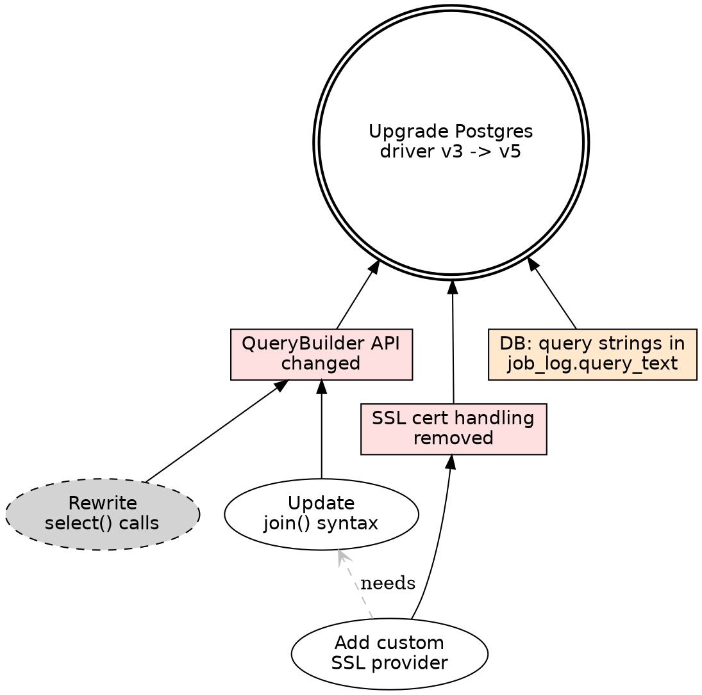

# Mikado Graph Reference

## mikado.md data structure

plan_<slug>.md is the single source of truth (slug derived from the goal). Use YAML frontmatter followed by a human-readable tree.
Example: goal "Upgrade Postgres driver v3 -> v5" -> slug "upgrade-postgres-driver-v3-v5" -> files: plan_upgrade-postgres-driver-v3-v5.md + plan_upgrade-postgres-driver-v3-v5.dot + plan_upgrade-postgres-driver-v3-v5.svg

Every plan_<slug>.md MUST include a `## How to execute` section immediately before `## Graph`.
This section makes the plan self-contained so any agent can execute it without the skill loaded.
Use this template (substituting <slug> with the actual slug):

```markdown
## How to execute

1. Find all leaf nodes: status=open with no open children.
2. Implement one leaf at a time — do not start the next until the current is done.
3. After completing each leaf:
   a. Set its status to `done` in this file.
   b. Regenerate `plan_<slug>.dot` and re-render the SVG:
      `dot -Tsvg plan_<slug>.dot > plan_<slug>.svg`
   c. Commit with the node label as the commit message.
4. When all children of a problem node are done, that problem becomes the next leaf.
5. Repeat until the root goal (G1) is marked done.

**One node = one commit. Never batch multiple nodes into a single commit.**
```

```markdown
---
slug: upgrade-postgres-driver-v3-v5
goal: "Upgrade Postgres driver v3 -> v5"
nodes:
  - id: G1
    label: "Upgrade Postgres driver v3 -> v5"
    type: goal
    status: open
    children: [P1, P2]
  - id: P1
    label: "QueryBuilder API changed"
    type: problem
    status: open
    children: [T1, T2]
  - id: T1
    label: "Rewrite select() calls"
    type: todo
    status: done
    children: []
  - id: T2
    label: "Update join() syntax"
    type: todo
    status: open
    children: []
    depends_on: [T3]   # T3 must be done before T2 can start
  - id: P2
    label: "SSL cert handling removed"
    type: problem
    status: open
    children: [T3]
  - id: T3
    label: "Add custom SSL provider"
    type: todo
    status: open
    children: []
  - id: I1
    label: "DB: query strings in job_log.query_text"
    type: impact
    status: open
    children: []
    note: "Raw SQL stored in this column uses v3 syntax; needs a data migration"
---

## Graph

- [goal] Upgrade Postgres driver v3 -> v5
  - [problem] QueryBuilder API changed
    - [done] Rewrite select() calls
    - [todo] Update join() syntax  (needs: T3)
  - [problem] SSL cert handling removed
    - [todo] Add custom SSL provider      <- READY  (T2 depends on this)
  - [impact] DB: query strings in job_log.query_text   <- READY (data migration needed)
```

## mikado.dot generation rules

Node shape mapping:
- type=goal                             -> shape=doublecircle
- type=problem  AND status=open         -> shape=rectangle, fillcolor="#ffe0e0"
- type=impact   AND status=open         -> shape=rectangle, fillcolor="#ffe8cc"  (orange = outside codebase)
- type=todo     AND status=open         -> shape=ellipse
- any           AND status=done         -> shape=ellipse, style="dashed,filled", fillcolor=lightgray

Edge direction: child -> parent (prerequisite direction)
Cross-dependency edges: dependency -> dependent, rendered as dashed gray arrows
  style: [style=dashed color=gray arrowhead=open]
  meaning: the source must be done before the target can start

Label for done nodes: prepend checkmark -- "T1" label becomes "[done] Rewrite select() calls"

Leaf / actionable rule:
  A node is actionable (rendered as plain ellipse) only if ALL of these are true:
    1. status=open
    2. no children (or all children are done)
    3. no depends_on entries that are still open

## Impact checklist

When a goal or problem involves renaming/moving a class, field, method, table, or concept,
proactively check each area below and add an impact node if relevant:

**Database**
- Discriminator columns (e.g. `type VARCHAR` in single-table inheritance)
- Polymorphic association columns (e.g. `owner_type`, `*_class`)
- Serialized/JSON columns storing class or field names
- Flyway/Liquibase migration scripts referencing old names
- Stored procedures or views hard-coding column/table names

**Serialization & messaging**
- Jackson `@JsonTypeName` / `@type` fields in stored JSON (DB, files, S3)
- Avro / Protobuf schema field names baked into binary data
- Event sourcing: event-type strings stored in the event log
- Message queue routing keys tied to class or method names

**Configuration**
- Spring bean names, `@Qualifier`, `@Component("name")` used as string keys
- application.yml / .properties keys referencing class names
- Externalized config in Consul, Vault, or env vars

**Reflection & dynamic dispatch**
- `Class.forName(...)` or `classloader.loadClass(...)` calls with hardcoded names
- Method references stored as strings and invoked via reflection
- Annotation processors generating code from class/field names (MapStruct, Lombok, etc.)

**Documentation & contracts**
- OpenAPI spec field names used by external consumers
- Client SDKs generated from the old contract
- Public API guarantees / changelogs

**Tests & tooling**
- Test fixtures with hardcoded class/field name strings
- SQL seed data referencing old discriminator values
- CI scripts or Makefiles referencing old module/package names

Add an impact node (type=impact, orange rectangle) for each relevant area.
Link it as a child of the problem/goal it belongs to.

## Full DOT example



## Render command

The skill runs this automatically after every graph change:

```sh
dot -Tsvg plan_<slug>.dot > plan_<slug>.svg
```

Example:
```sh
dot -Tsvg plan_upgrade-postgres-driver-v3-v5.dot > plan_upgrade-postgres-driver-v3-v5.svg
```

Or paste DOT content into https://dreampuf.github.io/GraphvizOnline/

## YAML node fields

| field      | values                             | meaning                              |
|------------|------------------------------------|--------------------------------------|
| id         | G1, P1, I1, T1 ...                 | stable identifier                    |
| label      | string                             | display text                         |
| type       | goal / problem / impact / todo     | determines default shape             |
| status     | open / done                        |                                      |
| children   | list of ids                        | nodes that block this one            |
| depends_on | list of ids                        | peer nodes that must be done first   |

## Node ID convention

- G<n>  root goal (usually just G1)
- P<n>  problem nodes (discovered obstacles)
- I<n>  impact nodes (non-obvious side-effects outside the codebase)
- T<n>  todo nodes (actionable steps)

Auto-increment within each type. IDs are stable once assigned.

## Status transitions

```
open -> done     when user marks node solved
open -> open     when new child problem added (parent stays open, new rectangle appears)
```

When all children of a node are done, the node itself becomes the new actionable leaf
(shown as ellipse) until the user attempts it and discovers a new problem.
